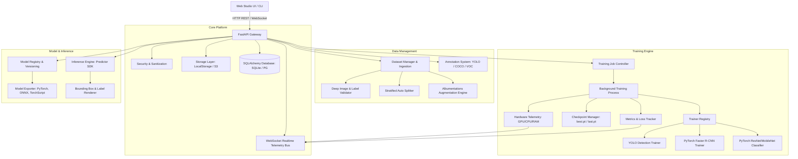
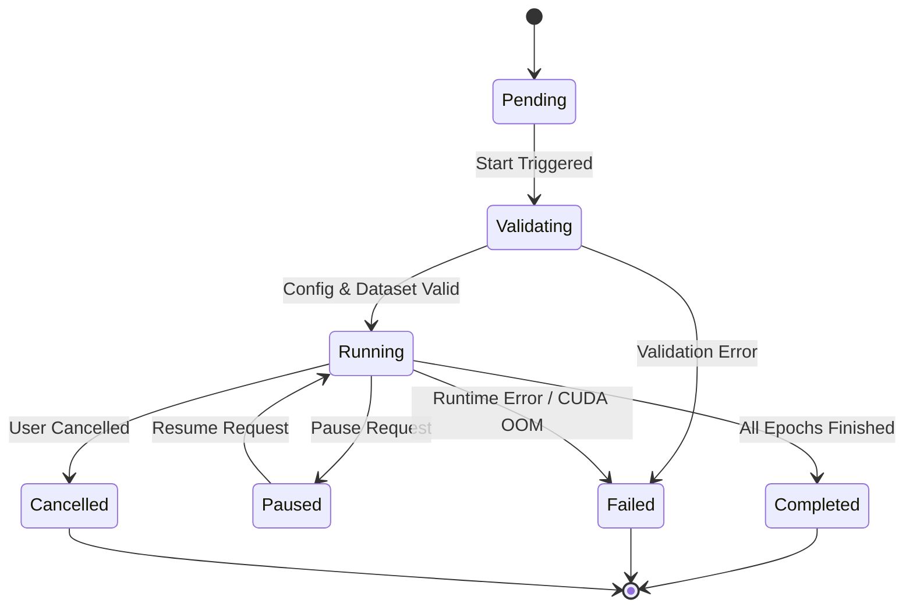
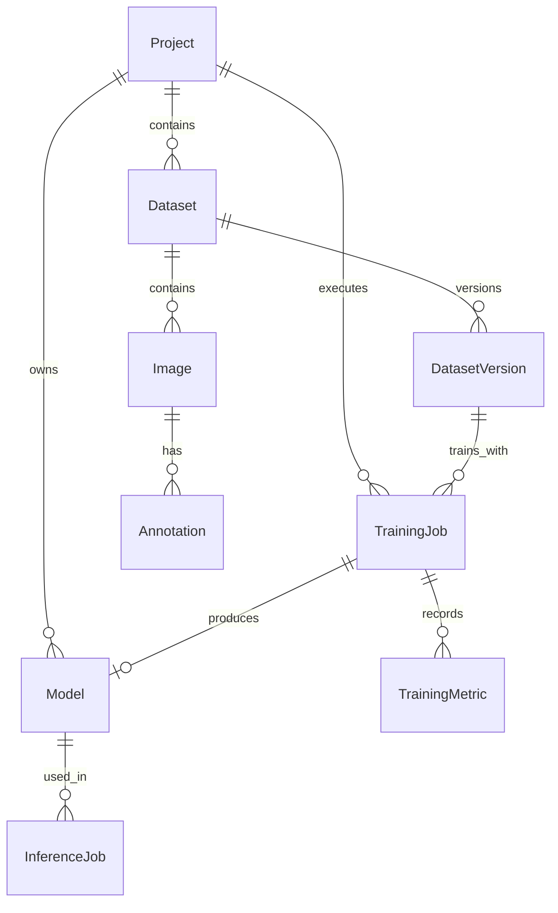

# AI Vision Training Studio - System Architecture

## 1. System Overview
**AI Vision Training Studio** is an end-to-end, modular, production-grade Computer Vision training and lifecycle management platform. It provides real dataset ingestion, deep validation, interactive bounding-box annotation, multi-model training with live telemetry, automated model registry, multi-format export (PyTorch, ONNX, TorchScript), and real-time bounding-box inference.

---

## 2. High-Level Component Diagram

---

## 3. Data Flow & Lifecycle State Machine

### 3.1 End-to-End User Flow
1. **Project & Dataset Creation**: User initializes a project (`detection` or `classification`) and uploads images (single, multi, or folder import).
2. **Sanitization & Storage**: Files are validated against MIME type and magic bytes, SHA-256 hashed for deduplication, and stored via `StorageBackend`.
3. **Annotation**: User tags objects on an interactive canvas. Labels are stored in normalized YOLO format (`class_id center_x center_y width height`).
4. **Validation & Split**: Dataset validator detects corrupted images, missing labels, and out-of-bounds coordinates. Stratified splitter splits into Train (70%), Val (20%), and Test (10%), generating `dataset.yaml`.
5. **Training Execution**: User configures hyperparameters. Worker spawns an isolated training job. PyTorch/Ultralytics executes real forward/backward passes.
6. **Live Telemetry**: Real-time loss, epoch metrics, and GPU/CPU stats stream via WebSockets to the live dashboard.
7. **Evaluation & Registration**: Upon completion, `best.pt` and `last.pt` are evaluated. Metrics (mAP50, mAP50-95, precision, recall, loss curves) and `metadata.json` are registered.
8. **Export & Inference**: User can export to ONNX or run direct inference on test images with bounding boxes drawn and download the output.

### 3.2 Training Job State Machine

---

## 4. Database Schema (Entity-Relationship)

### Table Definitions:
- **`projects`**: `id`, `name`, `description`, `task_type` (detection, classification), `created_at`, `updated_at`.
- **`datasets`**: `id`, `project_id`, `name`, `task_type`, `classes` (JSON), `total_images`, `total_annotations`, `train_count`, `val_count`, `test_count`, `status`.
- **`dataset_versions`**: `id`, `dataset_id`, `version_tag`, `manifest_path`, `split_ratio` (JSON), `augmentation_config` (JSON), `created_at`.
- **`images`**: `id`, `dataset_id`, `filename`, `file_path`, `file_size`, `width`, `height`, `split` (train/val/test/unassigned), `is_annotated`, `sha256`.
- **`annotations`**: `id`, `image_id`, `class_id`, `class_name`, `bbox_x`, `bbox_y`, `bbox_w`, `bbox_h`, `confidence`.
- **`training_jobs`**: `id`, `project_id`, `dataset_id`, `model_name`, `architecture`, `status`, `config` (JSON), `current_epoch`, `total_epochs`, `run_dir`, `checkpoint_path`, `error_message`.
- **`training_metrics`**: `id`, `job_id`, `epoch`, `step`, `loss`, `val_loss`, `metrics` (JSON: precision, recall, mAP50, mAP95), `lr`, `timestamp`.
- **`models`**: `id`, `project_id`, `job_id`, `name`, `version`, `architecture`, `task_type`, `classes` (JSON), `weights_path`, `onnx_path`, `metrics` (JSON), `metadata_info` (JSON), `size_bytes`.
- **`inference_jobs`**: `id`, `model_id`, `source_type`, `total_images`, `processed_images`, `output_dir`, `status`.
- **`system_configs`**: `id`, `key`, `value`, `description`.
- **`audit_logs`**: `id`, `action`, `entity_type`, `entity_id`, `details` (JSON), `timestamp`.

---

## 5. Storage Layer Design
The `StorageBackend` abstraction decouples business logic from disk storage:
- **`LocalStorage`**: Handles local file persistence, directory creation, path sanitization (`os.path.commonpath`), and streaming reads.
- **Pluggable Cloud Backends**: Compatible with AWS S3, MinIO, or Google Cloud Storage via standard interface methods (`save_file`, `get_file`, `delete_file`, `get_path`).

---

## 6. Training Engine & Registry
- **`TrainerBase`**: Abstract interface specifying `train()`, `validate()`, `save_checkpoint()`, `export()`, `stop()`, and `resume()`.
- **`TrainerRegistry`**: Factory pattern allowing registration of new models without modifying core code.
- **Process Isolation**: Training runs in a dedicated background worker process so server response time remains sub-millisecond, and CUDA memory leaks or crashes are isolated from the API server.
- **Hardware Agnostic**: Automatically interrogates `torch.cuda.is_available()`. Defaults to CUDA if present; otherwise seamlessly falls back to CPU with tailored hyperparameter presets.

---

## 7. Security Architecture
- **Path Traversal Protection**: All user-supplied filenames and paths are sanitized using strict alphanumeric sanitizers and validated to stay within project storage roots.
- **File Integrity & Signatures**: File uploads are verified using Python `imghdr` / `PIL.Image.verify()` and magic bytes to block masqueraded scripts or corrupted payloads.
- **CORS & Rate-Limiting**: Configurable CORS origins and upload size limits (default 500MB per batch).
- **Error Obfuscation**: Production exceptions return clean user-facing error messages while full tracebacks are safely written to server logs.
