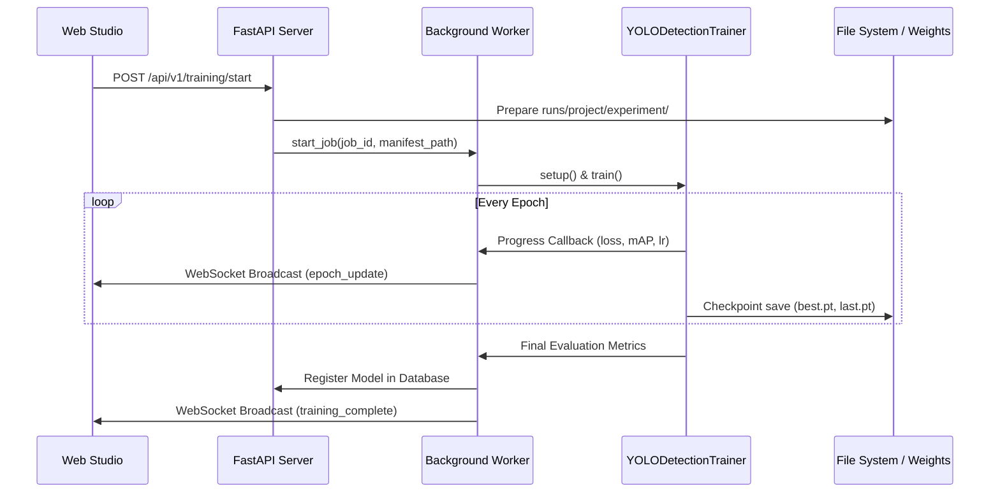

# Model Training Guide - AI Vision Training Studio

## 1. Supported Architectures

### Object Detection:
- **YOLO11n / YOLOv8n**: Lightweight, ultra-fast nano models (ideal for CPU or edge deployment).
- **YOLO11s / YOLOv8s**: Small models offering balanced speed and accuracy for real-time production.
- Extensible: New models can be added by registering with `TrainerRegistry.register("my_model", CustomTrainer)`.

### Image Classification:
- **ResNet-18 / ResNet-50**: Deep residual network for standard vision benchmarks.
- **MobileNet-V3-Small**: Ultra-efficient convolutional architecture for low-latency inference.

---

## 2. Training Workflow



---

## 3. Training via Web Studio
1. Navigate to **Training** tab in the sidebar.
2. Select your Target Dataset.
3. Choose Architecture (`yolo11n` recommended for quick turnaround).
4. Configure Epochs (e.g., 20 - 50) and Batch Size (8 or 16).
5. Select Device (`auto` detects CUDA GPU automatically, fallback to CPU).
6. Click **Start Training**. Watch real-time loss and metric curves update live!

---

## 4. Training via Python SDK / Script
```python
import yaml
from pathlib import Path
from app.training.trainers.detection_yolo import YOLODetectionTrainer

config = {
    "architecture": "yolo11n",
    "epochs": 30,
    "batch_size": 16,
    "image_size": 640,
    "learning_rate": 0.001,
    "device": "auto",
}

trainer = YOLODetectionTrainer(
    job_id=1,
    config=config,
    run_dir=Path("data/runs/wildlife/yolo11n_run1"),
    on_progress_callback=lambda p: print(f"Epoch {p['epoch']}: Loss={p['loss']}"),
)

trainer.setup(Path("data/datasets/wildlife_dataset/dataset.yaml"))
metrics = trainer.train()
print("Training Complete! Final Metrics:", metrics)
```

---

## 5. Model Exports
Once training completes, models can be converted to production formats:
- **ONNX**: Optimized with `onnxslim` for TensorRT, ONNX Runtime, and OpenVINO.
- **TorchScript**: For zero-dependency C++ or native PyTorch runtimes.
- **PyTorch .pt**: Standard weights file containing weights and class metadata.
